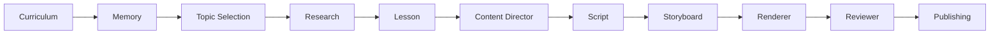
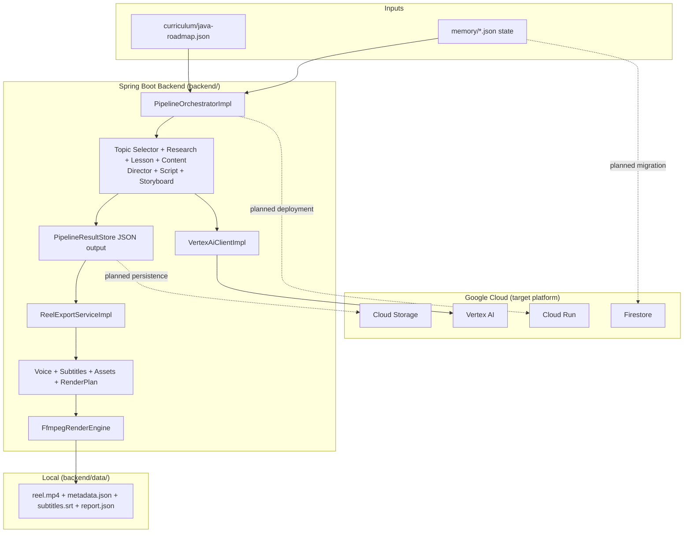

# ForgeBrain

ForgeBrain is an AI-powered content pipeline for generating short-form educational videos, starting with Java learning content.

## What ForgeBrain Is Building

ForgeBrain turns a structured curriculum into publish-ready reels through a staged pipeline that combines deterministic logic, LLM generation, and production/review tooling.

## End-to-End Pipeline Flow

Current executable slice: **Curriculum -> MP4**, end to end, in the Spring Boot backend —
`ReelExportService` runs Topic Selection through Storyboard (`PipelineOrchestrator`), then Voice,
Subtitles, Assets, and a real local FFmpeg render, producing a playable reel. See
[`backend/README.md`](backend/README.md)'s "End-to-End Reel Export" section.

## Architecture (Current + Planned)

## Current Status

This reflects the repository as of the latest backend vertical slice (`NEXT_EXECUTION.md`, `backend/README.md`).

### Implemented

- End-to-end orchestration from **Topic Selection -> Storyboard** (`PipelineOrchestratorImpl`, `runFullPipeline()`).
- End-to-end reel export from **Topic Selection -> MP4** (`ReelExportServiceImpl`, `exportReel()`),
  continuing the above through Voice, Subtitles, Assets, and a real local FFmpeg render.
- Working stage implementations for:
  - Curriculum loading
  - Memory storage (local JSON files)
  - Topic selection
  - Research
  - Lesson
  - Content Director
  - Script
  - Storyboard
  - Voice Generation (real-file measurement or a real, documented silent-track fallback — see backend/README.md)
  - Subtitle Generation (word-alignment and proportional-estimate reconciliation)
  - Asset Management (local catalog resolution with deterministic placeholder fallback)
  - Renderer (`FfmpegRenderEngine` — real, local, deterministic MP4 export)
- Vertex AI integration in backend for:
  - Research, Lesson, Content Director, and Script generation
  - Shared client (`VertexAiClientImpl`) with ADC-based auth.
- Pipeline result persistence to local JSON artifacts.
- Pipeline execution report generation per run under `reports/`, plus a dedicated reel export
  diagnostics report (`report.json`) written alongside every rendered reel (stage-by-stage
  observability for both paths).
- Automated tests for orchestrator, stage behavior, and a real `ffmpeg`-backed end-to-end render.

### Planned / Not Yet Implemented

- A real Text-to-Speech provider behind Voice Generation (Google Cloud Text-to-Speech; the seam
  is ready, see `renderer/voice-spec.md` Section 6).
- A real, populated asset catalog behind Asset Management (font files, background media, licensed
  music — currently an empty local directory, ideally Cloud Storage-backed in a real deployment).
- Reviewer and Publishing stages.
- `RendererService`/`RenderJob` asynchronous job-lifecycle tracking around the render engine
  (rendering itself runs synchronously today).
- Analytics feedback loop activation.
- Firestore-backed persistence (currently local file memory state).
- Cloud Storage-backed media/output storage.
- Cloud Run deployment path (config scaffolding exists; deployment infra not yet implemented).

## Technology Stack (Google Cloud Focused)

- **Spring Boot 3.x / Java 21 LTS / Maven**: Core orchestration and service runtime.
- **Vertex AI (Gemini via Java SDK)**: Live LLM integration for research, lesson, content
  director, and script stages.
- **FFmpeg (local)**: Real video rendering backend — see backend/README.md's "Storyboard to
  MP4" section.
- **Cloud Storage**: Planned artifact/media storage target.
- **Firestore**: Planned persistent memory and pipeline state backend.
- **Cloud Run**: Planned deployment target for the backend service.

## Repository Structure

| Folder | Purpose |
| --- | --- |
| `backend/` | Spring Boot implementation and pipeline orchestration. |
| `brain/` | Specs/schemas/examples for topic selection, research, lesson, strategy, script, storyboard. |
| `renderer/` | Specs/schemas for voice, subtitles, assets, rendering. |
| `reviewer/` | Specs/schemas for quality scoring and review decisions. |
| `publishing/` | Specs/schemas for packaging approved output for publishing workflows. |
| `curriculum/` | Java roadmap dataset driving topic selection. |
| `memory/` | Memory model/spec describing learning state and decisions. |
| `analytics/` | Planned performance feedback loop specs. |
| `docs/` | Architecture and configuration documentation. |
| `TODO.md` | Backlog and implementation priorities. |
| `NEXT_EXECUTION.md` | Latest executable-slice implementation summary. |

## Project Roadmap

### Phase 1 - Brain Pipeline Execution
- Deliver reliable Curriculum -> Storyboard execution in backend.
- Expand deterministic + Vertex-backed generation quality.
- Keep schema-contract fidelity and strong test coverage.

### Phase 2 - Production Pipeline
- Implement Voice, Subtitles, Asset Management, and Renderer stages. **Done** — all four have
  real implementations, composed end to end by `ReelExportService` into a playable MP4.
- Produce repeatable video package outputs from storyboard artifacts. **Done** for the local path;
  swapping in a real TTS provider and a real asset catalog remains (see "Planned" above).

### Phase 3 - Quality and Publishing
- Implement Reviewer scoring/gates and Publishing package flow.
- Close the full path from curriculum topic to publish-ready output.

### Phase 4 - Cloud and Optimization
- Move persistence/artifacts to Firestore + Cloud Storage.
- Deploy runtime to Cloud Run.
- Activate analytics-driven iteration and performance feedback loops.

## Getting Started

1. Read [`docs/PIPELINE.md`](docs/PIPELINE.md) for stage contracts.
2. Read [`backend/README.md`](backend/README.md) for executable backend details.
3. See [`NEXT_EXECUTION.md`](NEXT_EXECUTION.md) for the current vertical slice and known gaps.
4. See [`TODO.md`](TODO.md) for prioritized next implementation steps.
